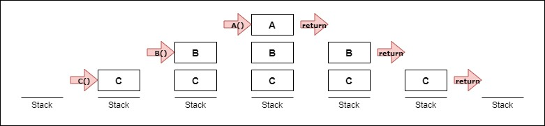

## Introduction

The first data structure we will be looking at in this tutorial is the stack.

A **stack** is a collection of elements stored in a list. There are many actions we can perform on a stack depending on what we need. However, for the purposes of this tutorial, there are two main operations we perform on a stack: **pushing** and **popping**.

When we push, we add an element to the back of the stack. And when we pop, we remove an element from the back of the stack.

## Last In, First Out

Imagine a stack of books resting on a table, like so:


Now, picture yourself taking a book (popping) from the stack. Where did you take the book from? The top, the bottom, the middle?

When it comes to programming, we always take the element (the book) from the back of the stack (which, in our example, is at the top). Likewise, we always append the element to the back of the stack.

This rule of pushing and popping from the back of the stack is known as **Last In First Out (LIFO)** because the _last_ element _in_ is also the _first_ to be taken _out_.

## The Function Stack

We use stacks all the time in software. This is because **functions** use the stack.

In Python, when a function is called, it is pushed to the stack. In this example code, we begin with an empty stack. Function `C` is pushed, followed by `B` and then `A`. Once `A` is finished, it is popped and `B` resumes. And when `B` is popped, it goes to `C`. When `C` is popped, the function stack is empty once again.

```python
def A():
    return

def B():
    A()
    return

def C():
    B()
    return

C()
```

The following diagram is a representation of the stack from the example:



## Performance

| Stack Operation | Python Code | Performance
| --- | --- | ---
| **push** | `stack.append(value)` | O(1)*
| **pop** | `stack.pop()` | O(1)*
| **size** | `len(stack)` | O(1)*
| **empty** | `if len(stack) == 0:` | O(1)*

_*Note: The performance of these operations are based on the performance of the dynamic array. A linked list would also give you O(1) for the stack._

As you can see, the overall performance of the stack is very good.

## Example

Let's revisit the stack of books analogy from earlier. Take a look at the code below:

```python
stack = []
stack.append("Moby Dick")
stack.append("The Great Gatsby")
stack.append("Hamlet")
stack.pop()
stack.append("The Iliad")
stack.append("Pride and Prejudice")
stack.pop()
stack.append("To Kill a Mockingbird")
stack.append("Gulliver's Travels")
stack.append("Don Quixote")
stack.pop()
stack.pop()
stack.pop()
stack.pop()
print(stack)
```

Can you predict [what will be printed](code/1-example-solution.py)?

## Problem to Solve

You are a bored volunteer at your local library. Mr. Edgar, the head librarian, asks you to make sure the bookends are balanced on every shelf.

Here is your task:

1. Using the stack, find all the **bookends** on the shelf. (A book is `|`, an opening bookend is `[`, and a closing bookend is `]`.)
1. Determine whether the bookends are **balanced**. The bookends are considered balanced if:
    * Each opening bookend can be paired with a closing bookend.
    * No _unpaired_ closing bookend is found before an opening bookend.
1. Print `True` if the bookends are balanced, or `False` if they are not.

### I/O

| Example Input | Example Output
| ------------ | -------------
| `[]` | `True`
| `][` | `False`
| `[][` | `False`
| <code>[&#124;&#124;&#124;]</code> | `True`
| <code>&#124;&#124;&#124;&#124;</code> | `True`

### Hint

[Pop!](https://www.w3schools.com/python/ref_list_pop.asp) goes the weasel.

### Solution

Click [here](code/1-problem-solution.py) to see the solution. Remember, you should only look at it after you have attempted to solve the problem first.