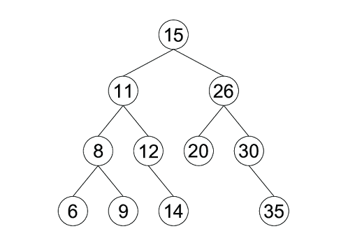
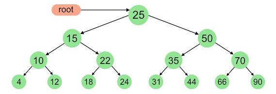

## Introduction

The third and final data structure we will be looking at in this tutorial is the tree.

A **tree** is a collection of nodes, similar to a [linked list](2-linked-list.md), that is organized in a **hierarchical** structure. What does that mean? In the case of a tree, it means that the nodes are organized into two groups: **parents**, and **children**.

A parent node is a node that links to other nodes. Likewise, a child node is connected to the parent. (It is possible for a node to be _both_ a parent and child.)

Two more things before we continue:

1. The topmost node is called the **root**.
1. A node that connects to no other node is called a **leaf**.

## Binary Trees

A **binary search tree (BST)** is a tree in which the nodes link to no more than _two_ other nodes. A BST has left and right subtrees, which are formed by the nodes to the left and right of any parent.



Furthermore, there is a special rule that must be followed when data is added to the BST. If the data value is less than the parent node, it is put in the left subtree. If the value is greater than the parent node, it is put in the right subtree. _The data in a BST is always sorted_ from left to right and from least to greatest.

## Recursion

Before you start coding, it's important that you know about **recursion**. In programming, it's when a function calls itself:

```python
def factorial(n):
    """This is a recursive function that
    finds the factorial of an integer."""
    if n == 1:
        return 1
    else:
        return n * factorial(n-1)

n = 4  # Try it with different numbers!
print(f"The factorial of {n} is {factorial(n)}.")
```

The `factorial` function repeatedly calls itself with a decreasing number `n`. But how does the function know when to stop? We use the **base case**. In this case, when `n` is reduced to `1`, the function ends.

Remember that special rule about the BST? Recursion is what's used to sort the data.

## Inserting

```python
tree = Tree()
tree.create_node("Aaron", "aaron")  # root node
tree.create_node("Barry", "barry", parent="aaron")
tree.create_node("Charlie", "charlie", parent="aaron")
tree.show()
'''
Aaron
├── Barry
└── Charlie
'''
```

(For the code examples, make sure to install [treelib](https://treelib.readthedocs.io/en/latest/).)

## Traversing

When we want to display all the data in a tree, we can use **traversal**. In this tutorial, we will use **in-order traversal**, which visits each node from smallest to largest (according to the aforementioned [special rule](#binary-trees) of BSTs).



For example, if we were to use in-order traversal for the tree shown above, the nodes would be visited in the following order:

```
4, 10, 12, 15, 18, 22, 24, 25, 31, 35, 44, 50, 66, 70, 90
```

## Performance

| Tree Operation | Python Code | Performance
| --- | --- | ---
| **insert** | `tree.add_node(nid, parent)` | O(log n)
| **remove** | `tree.remove_node(nid)` | O(log n)
| **contains** | `tree.contains()` | O(log n)
| **traverse** | `for node in tree.nodes:`* | O(log n)
| **height** | `tree.depth()` | O(log n)
| **size** | `tree.size()` | O(1)
| **empty** | `if tree.size() == 0:` | O(1)

_*Note: This code will not perform an in-order traversal._

## Example

Take a look at this code:

```python
tree.create_node("B", 16, parent=25)
tree.create_node("C", 33, parent=25)
tree.create_node("D", 39, parent=33)
tree.create_node("E", 5, parent=16)
tree.create_node("F", 24, parent=16)
tree.create_node("G", 30, parent=33)
```

Can you predict what the [in-order traversal of this tree](code/3-example-solution.py) will be?

## Problem to Solve

Congratulations! You've made it to the end of the tutorial. This is the final problem. Good luck!

Here is your task:

1. Write a function called `create_tree` that creates a tree from a list `L` of `7` elements.
1. Write a function called `find_closest` that finds the node that is closest to a given value in a tree.
1. Write a function called `remove_node` that removes a node with a given value in a tree.
1. Call each function and display the result.

### I/O

```
List of 7 elements: 1 2 3 4 5 6 7
1
├── 2
│   ├── 4
│   └── 5
└── 3
    ├── 6
    └── 7

Target: 11
The closest node to the target of 11 is 7.
Node to remove: 3
1
└── 2
    ├── 4
    └── 5

Node 3 was removed.
```

### Hint

Do you [comprehend lists](https://www.w3schools.com/python/python_lists_comprehension.asp)?

### Solution

Click [here](code/3-problem-solution.py) to see the solution. Remember, you should only look at it after you have attempted to solve the problem first.